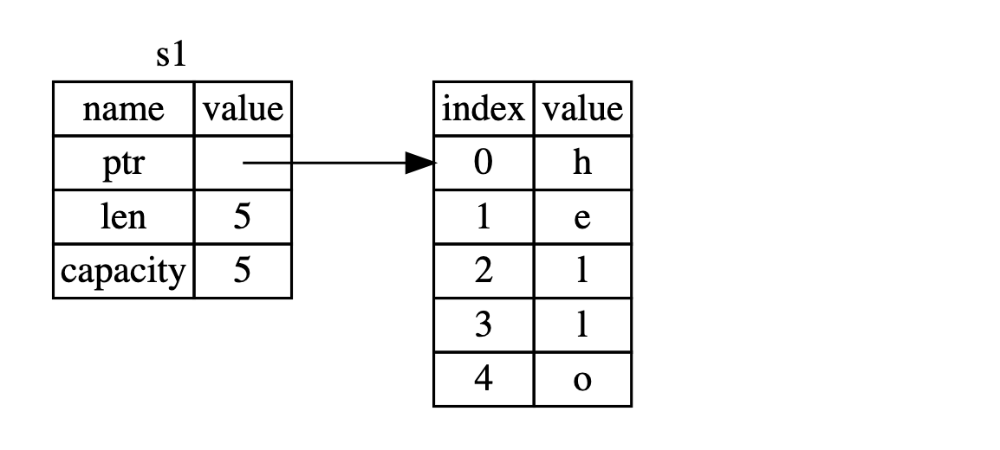
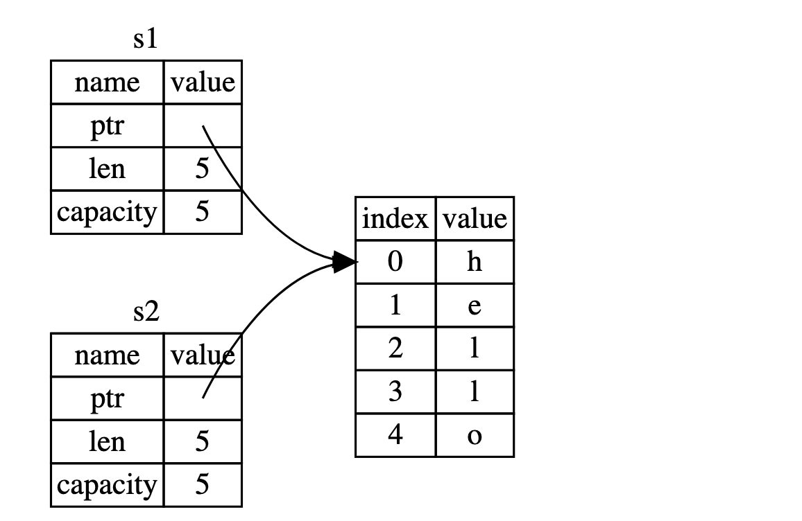
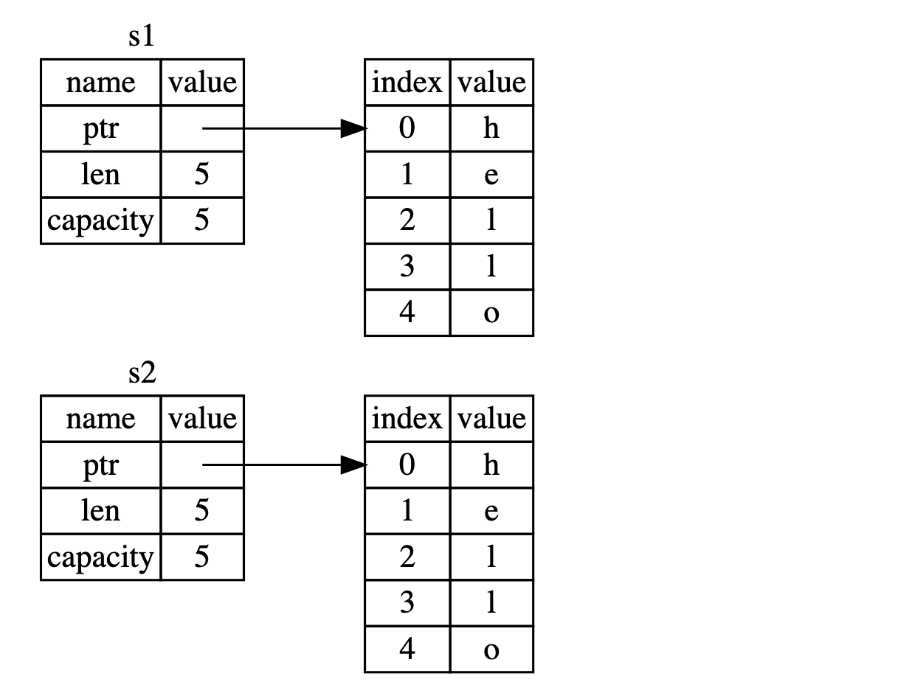
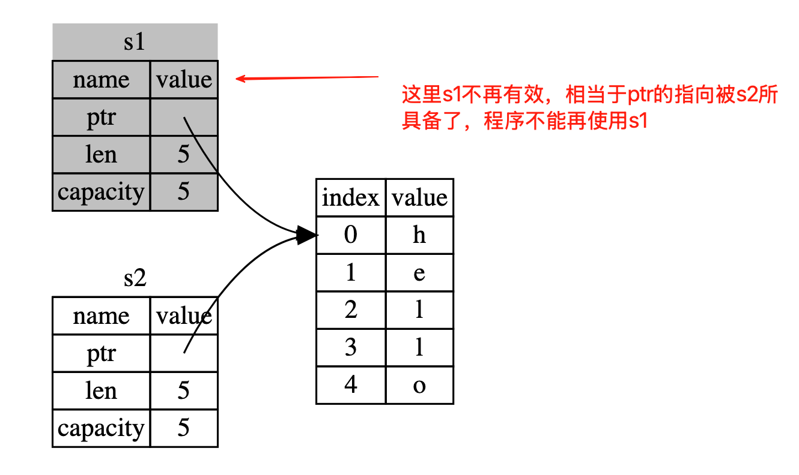

# ownership
- 所有权（ownership）是 Rust 用于如何管理内存的一组规则。所有程序都必须管理其运行时使用计算机内存的方式。
- 一些语言中具有垃圾回收机制，在程序运行时有规律地寻找不再使用的内存；在另一些语言中，程序员必须亲自分配和释放内存。
- Rust 则选择了第三种方式：通过所有权系统管理内存，编译器在编译时会根据一系列的规则进行检查。
- 如果违反了任何这些规则，程序都不能编译。 在运行时，所有权系统的任何功能都不会减慢程序的运行。

因为所有权对很多程序员来说都是一个新概念，需要一些时间来适应。好消息是随着你对 Rust 和所有权系统的规则越来越有经验，你就越能自然地编写出安全和高效的代码。持之以恒！

# rules
- Rust语言中的每一个值都有一个所有者（owner），就是每个变量具有唯一标识。
- 每个值在任一时刻有且只有一个所有者。 
- 当变量的所有者离开作用域时，这个值将被丢弃。

示例代码如下：
```rust
fn main() {
    // 作用域
    // 1.块作用域
    {
        let s1 = "hello";
        println!("s1:{}",s1);
    } // 这一行执行时，s1变量的作用范围就会自动失效，也就是说会自动清理s1
    println!("s1={}",s1); // 这里就不能使用块级作用域中的s1

    // 2.所有权转移
    let s = String::from("hello");
    let s2 = s;
    // 这里就不能继续使用s，运行会报错：^ value borrowed here after move
    // 因为s的所有者已转移到了s2，因此s不能再使用了
    println!("s: {}", s);
    println!("s2: {}", s2);
}
```

在rust中变量默认是不可变的，示例代码如下：
```rust
let greeter = String::from("hello");
greeter.push_str(", world!"); // 运行时会抛出这个错误：^^^^^^^ cannot borrow as mutable
```
在这里，为了解决上述问题，需要将greeter变成可变类型，通过关键字mut来修饰变量
```rust
let mut greeter = String::from("hello"); // 此时greeter是可变类型的变量
greeter.push_str(", world"); // 通过push_str追加字面量字符串
println!("{}", greeter);
```

# string
```rust
let s1 = String::from("hello");
let s2 = s1;
```
在rust中，String 由三部分组成，如下图1-1左侧所示：一个指向存放字符串内容内存的指针，一个长度，和一个容量。这一组数据存储在栈上。右侧则是堆上存放内容的内存部分。

当我们将s1赋值给s2后，s1的所有权就会发生转移。这里String的数据被复制了，这意味着我们从栈上拷贝了它的指针、长度和容量，并没有复制指针指向的堆上数据。换句话说，内存中数据的表现如下图1-2所示。

其实，这个表现形式看起来并不像下图 1-3 中的那样，如果 Rust 也拷贝了堆上的数据，那么内存看起来就是这样的。
如果 Rust 这么做了，那么操作 s2 = s1 在堆上数据比较大的时候会对运行时性能造成非常大的影响。

当变量离开作用域后，Rust 自动调用 drop 函数并清理变量的堆内存。

图 1-2 展示了两个数据指针指向了同一位置。这就有了一个问题：当 s2 和 s1 离开作用域，它们都会尝试释放相同的内存。这是一个叫做 二次释放（double free）的错误，也是之前提到过的内存安全性 bug 之一。两次释放（相同）内存会导致内存污染，它可能会导致潜在的安全漏洞。
为了确保内存安全，在 let s2 = s1; 之后，Rust 认为 s1 不再有效，因此 Rust 不需要在 s1 离开作用域后清理任何东西。

## about copy
- 在其他语言中听说过术语 `浅拷贝（shallow copy）`和 `深拷贝（deep copy）`，那么拷贝指针、长度和容量而不拷贝数据可能听起来像浅拷贝。
- 不过因为 Rust 同时使第一个变量无效了，这个操作被称为 `移动（move）`，而不是叫做浅拷贝。
- 上面的例子可以解读为 s1 被 移动 到了 s2 中，背后发生的现象如下图1-4所示


- 这样就解决了我们的问题！因为只有 s2 是有效的，当其离开作用域，它就释放自己的内存，完毕。
- 另外，这里还隐含了一个设计选择：`Rust 永远也不会自动创建数据的 “深拷贝”`。因此，任何自动的复制都可以被认为是对运行时性能影响较小的。

如果我们 确实 需要深度复制 String 中堆上的数据，而不仅仅是栈上的数据，可以使用一个叫做 clone 的常用方法。
```rust
let s1 = String::from("hello");
let s2 = s1.clone(); // 这里通过调用clone方法，克隆出一个新的变量s2
println!("s1 = {s1}, s2 = {s2}"); // 这里可以继续使用s1
```

基本数据类型，例如：数字，字符等，它是将数据放在栈上
```rust
let x = 5; // 这里x是一个i32类型的数字
let y = x; // 将x赋值给y，这里并不需要发生所有权转移，而是将栈上的数据做了一个复制，按位复制
println!("x = {x}, y = {y}");
```
- x能继续使用的原因是像整型这样的在编译时已知大小的类型被整个存储在栈上，所以拷贝其实际的值是快速的。
- 这意味着没有理由在创建变量 y 后使 x 无效。换句话说，这里没有深浅拷贝的区别，所以这里调用 clone 并不会与通常的浅拷贝有什么不同，我们可以不用管它。

## copy trait
- Rust 有一个叫做 `Copy trait` 的特殊注解，可以用在类似整型这样的存储在栈上的类型上。如果一个类型实现了 `Copy trait`，那么一个旧的变量在将其赋值给其他变量后仍然有效。
- Rust 不允许自身或其任何部分实现了 `Drop trait` 的类型使用 `Copy trait`。如果我们对其值离开作用域时需要特殊处理的类型使用 `Copy注解`，将会出现一个编译时错误。

那么哪些类型实现了 Copy trait 呢？你可以查看给定类型的文档来确认，不过作为一个通用的规则，任何一组简单标量值的组合都可以实现 Copy，任何不需要分配内存或某种形式资源的类型都可以实现 Copy 。如下是一些 Copy 的类型：
- 所有整数类型，比如 u32。
- 布尔类型，bool，它的值是 true 和 false。
- 所有浮点数类型，比如 f64。
- 字符类型，char。
- 元组，特别说明一点：当且仅当其包含的类型都实现了Copy trait，这个元组才真正实现了 `Copy trait`。比如，(i32, i32) 实现了 Copy，但 (i32, String) 就没有，因为String并不是基础类型，它是一个u8 vec组成的结构体类型。

# Ownership and functions
向函数传递值可能会移动或者复制，就像赋值语句一样，下面的代码将所有权转移到了函数内部
```rust
let s1 = String::from("hello");
takes_ownership(s1);// 将s1的所有权转移到了函数内部，当函数执行完毕后，s1的所有权就会自动被释放了，也就是s1变量就会失效
// println!("s1 is {}", s1);// 这里s1就不能再使用，会报错：^^ value borrowed here after move
let x = 5;
makes_copy(x);
println!("x = {}", x);

// 将所有权转移到了函数内部
fn takes_ownership(some_string: String) {
    println!("{}", some_string);
}

// 基本类型x这里发生是栈上数据拷贝操作，因此函数调用完毕后，这里的x还可以继续使用
fn makes_copy(x: i32) {
    println!("{}", x);
}
```
下面的把变量的所有权又重新返回，一般不建议这么做
```rust
// 该函数将传入字符串并返回该值
fn takes_and_gives_back(s: String) -> String {
    // s 进入作用域
    println!("s ={}",s);

    s  // 返回 s 字符串类型的所有权，移出给调用的函数
}
```

为了解决不转移的情况，可以使用不可变引用（借用）方式，实现方式如下：
```rust
 let s2 = String::from("hello");
borrow_ownership(&s2);
println!("s2 = {}", s2);

// 这里传递的是字符串类型的引用，借用方式
fn borrow_ownership(s: &str) {
    println!("{}", s);
}
```
